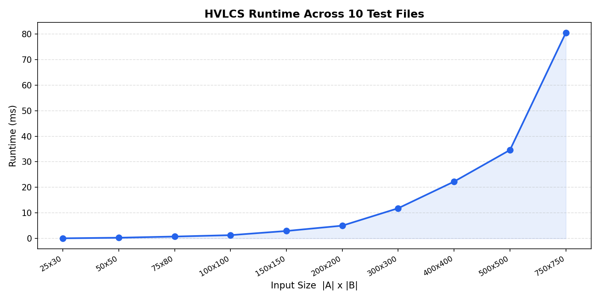

# Highest Value Common Subsequence
### COP 4533 Assignment 3

**Arthur Zanoelo** (93116277) 
**Matthew Beutel** (35151278)

---

## Structure

```
root/
├── src/hvlcs.py
├── data/
│   ├── example.in / example.out
│   ├── test_01.in ... test_10.in
│   ├── generate_tests.py
│   └── generate_plot.py
├── runtime_plot.png
└── README.md
```

---

## How to Run

```bash
python src/hvlcs.py data/example.in
```

Expected output:
```
9
cb
```

---

## Question 1: Empirical Comparison

| Test | \|A\| | \|B\| | Time (ms) |
|------|--------|--------|-----------|
| 1    | 25     | 30     | 0.18      |
| 2    | 50     | 50     | 0.55      |
| 3    | 75     | 80     | 1.19      |
| 4    | 100    | 100    | 1.86      |
| 5    | 150    | 150    | 4.53      |
| 6    | 200    | 200    | 7.29      |
| 7    | 300    | 300    | 20.9      |
| 8    | 400    | 400    | 38.4      |
| 9    | 500    | 500    | 69.9      |
| 10   | 750    | 750    | 147.9     |



To regenerate test files: `python data/generate_tests.py`  
To regenerate plot: `python data/generate_plot.py`

---

## Question 2: Recurrence Equation

Let `OPT[i][j]` = max value of a common subsequence of `A[0..i-1]` and `B[0..j-1]`.

Base cases:
```
OPT[0][j] = 0   for all j   (empty prefix of A -> no common characters)
OPT[i][0] = 0   for all i   (empty prefix of B -> no common characters)
```

Recurrence:
```
If A[i-1] == B[j-1]:
    OPT[i][j] = OPT[i-1][j-1] + v(A[i-1])
        (we can always extend a common subsequence by matching equal chars,
        matching is never worse than skipping)
Else:
    OPT[i][j] = max(OPT[i-1][j], OPT[i][j-1])
        (skip either A[i-1] or B[j-1] and just take the better option)
```

Reasoning:
- When characters match, including them never decreases value (v >= 0), so we always take the match.
- When they differ, the optimal subsequence either excludes A[i-1] or B[j-1], so we take the max of both sub-problems.
- The table is filled in order of increasing i and j, so all sub-problems are solved before they are needed.

---

## Question 3: Pseudocode and Runtime

The solution to HVLCS is provided in `src/hvlcs.py`. The runtime is **O(n * m)**, where n = |A| and m = |B|.